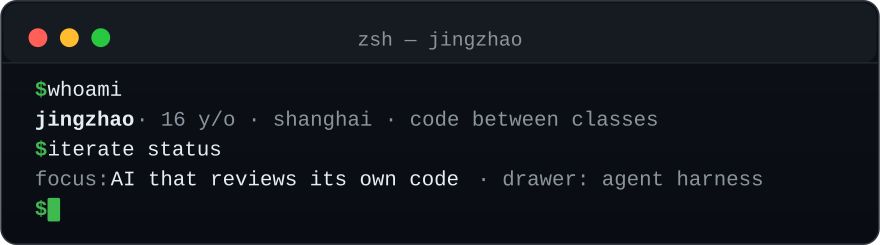
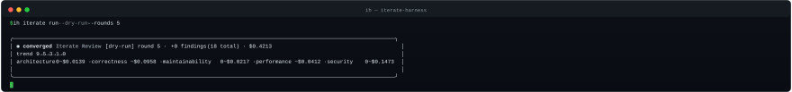

## // whoami

- 🎓 **16 岁，上海高中生** —— 作业写完才开机，代码都在深夜和周末生长。 
  A 16-year-old high schooler in Shanghai — most of my code grows after homework, on weekends and at midnight.
- 🤖 **我关注的命题**：让 AI 像工程师一样对待自己的代码——计划、评审、修复、验证、回环，而不是一次生成听天由命。 
  My obsession: making AI treat its own code like an engineer — plan, review, fix, verify, loop — not write-once-and-pray.
- 🔭 **抽屉里**：一个大型 agent harness 项目，在课间和深夜慢慢生长。 
  In the drawer: a large-scale agent harness, slowly growing between classes.

## // ls iterate/

**把「AI 写完就走」变成「AI 自己审、自己改、自己验证」**。 
Turning "AI writes and prays" into "AI reviews, fixes and verifies its own work — round after round".

iterate-harness 的收敛面板：5 轮把 18 个 findings 清到 0，每个维度精确计费 
The iterate-harness convergence panel: 18 findings driven to zero in 5 rounds, with exact per-dimension billing

| 仓库 · Repo | 是什么 · What it is |
|---|---|
| 🧠 **[iterate-skill](https://github.com/jingzhao-l/iterate-skill)** | 面向对话式 agent 的多轮审查-修复技能：9 维度评审、双轨修复、决策日志、项目知识库 A skill for conversational agents: 9-dimension review, dual-track fixes, decision log, project knowledge base |
| ⚙️ **[iterate-harness](https://github.com/jingzhao-l/iterate-harness)** | 专为 iterate 打造的 coding harness（`ih` CLI + React TUI）：在 CI/PR 里无人值守地跑完整审查-修复闭环，含成本计量与阈值门禁 A coding harness purpose-built for iterate: runs the full review-fix loop unattended in CI/PR, with cost metering and threshold gates |
| 🖥️ **[iterate-plugin](https://github.com/jingzhao-l/iterate-plugin)** | 桌面插件：收敛仪表盘、逐轮进度、实时干预 Desktop plugin: convergence dashboard, round-by-round progress, live intervention |

三者共享同一套 `iterate.config.yaml` 与维度体系 —— **skill 给对话，harness 给 CI，plugin 给桌面**。 
All three share one config and one dimension system — **skill for chat, harness for CI, plugin for desktop**.

## // stack

## // stats

---

  ⭐ 如果 iterate 帮到了你，欢迎去仓库点个 Star · If iterate helps you, a star means a lot

